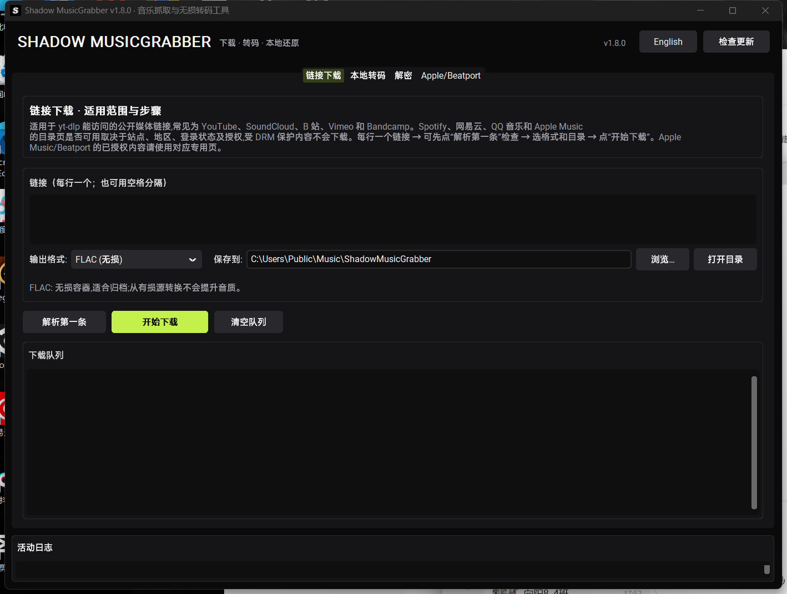
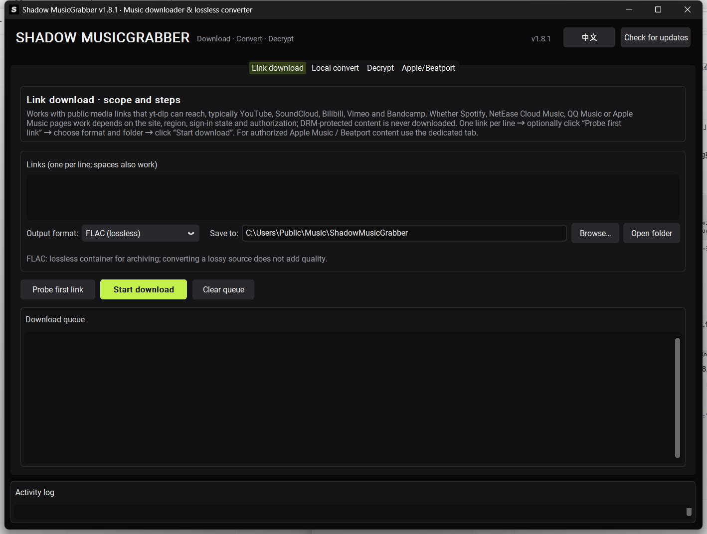

# Shadow MusicGrabber


Windows 桌面工具，四个彼此独立的工作模块：公开链接下载、本地音频转码、网易云 NCM 与 QQ 音乐加密文件还原，以及需要用户自己订阅和账号的 Apple Music / Beatport 下载。深色极简界面，**支持中英文双语**，内置 GitHub Releases 自动更新。

除了图形界面，仓库还内置一个 **MCP 服务**，可以让 Claude / Cursor / Shadow 等 AI 助手直接调用同一套能力——见 [使用方式二](#使用方式二接入-ai-agentmcp-服务)。

[](https://github.com/shadowroommusic/ShadowMusicGrabber/releases/latest)
[](LICENSE)

## 界面预览 / Screenshots

| 中文界面 | English UI |
| --- | --- |
|  |  |

A Windows desktop toolbox with four independent modules: public link downloading, local audio conversion, NetEase Cloud Music `.ncm` and QQ Music encrypted-file decryption, and Apple Music / Beatport downloading for accounts you own. Dark minimal UI with **Chinese/English interface** and built-in GitHub Releases auto-update. The repository also ships an **MCP server** so AI clients (Claude, Cursor, Shadow ...) can drive the same engine.

项目主页 / Repository: <https://github.com/shadowroommusic/ShadowMusicGrabber>

> 合法使用：只处理你拥有或明确获授权的内容。程序不绕过 DRM、订阅、地区限制、访问控制或加密壳。Apple Music / Beatport 的下载结果和可用音质由你的账号权限、地区和第三方工具决定。

应用图标：纯黑圆角底 + 白色 S，由 `tools/make_icon.py` 生成（改参数即可重画）。

## 选择你的使用方式

两种用法共用同一套核心模块（链接下载 / 本地转码 / NCM、QMC 解密），按需要选一个即可：

| 你想要 | 用哪个 | 怎么开始 |
| --- | --- | --- |
| 自己点点鼠标、图形界面操作 | **桌面版**（Windows） | 到 [Releases](https://github.com/shadowroommusic/ShadowMusicGrabber/releases/latest) 下载 EXE，双击即用，无需 Python |
| 让 AI 助手替你处理文件 | **MCP 服务** | 在 AI 客户端配置里加一行 `uvx`（任何装了 Python 的系统，含 macOS / Linux） |

## 使用方式一：桌面版（Windows）

### 直接运行 EXE（推荐）

打开 [Releases](https://github.com/shadowroommusic/ShadowMusicGrabber/releases/latest)，下载与你的系统匹配的文件。资产命名格式为 `ShadowMusicGrabber-<版本>-<平台>-<架构>.<扩展名>`：

| 系统 | 文件 |
| --- | --- |
| Windows 64 位 | `ShadowMusicGrabber-<版本>-windows-x64.exe` |

下载后直接运行，无需安装 Python。建议把 FFmpeg 放到 EXE 同目录（或在系统 PATH 中），否则下载/转码功能不可用。

程序内也可以从旧版本升级：打开程序，点右上角 **检查更新**，会自动下载并替换为新版本。

### 从源码运行

```powershell
git clone https://github.com/shadowroommusic/ShadowMusicGrabber.git
cd ShadowMusicGrabber
python -m pip install -r requirements.txt
python main.py
```

需要 Python 3.10+ 与可用的 FFmpeg，可用 `winget install Gyan.FFmpeg` 安装。程序会自动查找 PATH、程序目录、PyInstaller 临时目录和常见 WinGet 路径中的 `ffmpeg` / `ffprobe`。

## 使用方式二：接入 AI Agent（MCP 服务）

如果你在用 Claude Desktop、Cursor、Shadow 这类支持 MCP 的 AI 客户端，可以让它直接调用本工具的下载 / 转码 / 解密能力：不用打开界面，AI 自己处理文件。

仓库内置的 MCP 服务（`mcp_server.py`）不依赖任何第三方 MCP SDK，直接复用与桌面版完全相同的核心模块，走 stdio 传输，**任何装了 Python 的系统都能跑**（Windows / macOS / Linux）。

用 `uvx` 接入（无需克隆仓库、无需手动装依赖，客户端配置里加一段即可）：

```json
{
  "mcpServers": {
    "shadow-musicgrabber": {
      "command": "uvx",
      "args": [
        "--from", "git+https://github.com/shadowroommusic/ShadowMusicGrabber",
        "shadow-musicgrabber-mcp"
      ]
    }
  }
}
```

- **Claude Desktop**：写进 `claude_desktop_config.json` 的 `mcpServers`。
- **Cursor / 其他客户端**：同样填 `command` + `args` 即可。
- 也可以克隆仓库后直接运行 `python mcp_server.py`（同样是 stdio 服务）。

提供的工具：

| 工具 | 作用 |
| --- | --- |
| `probe_audio` | 读取本地音频的时长、码率、采样率与标签 |
| `decrypt_audio` | 解密单个 NCM / QQ 音乐文件，可顺带转码 |
| `decrypt_many` | 批量解密（支持目录递归） |
| `convert_audio` | 本地转码为 FLAC / WAV / MP3 |
| `probe_url` | 只解析链接信息（标题、时长），不下载 |
| `download_audio` | 从公开链接下载音频 |
| `get_capabilities` | 查询版本、ffmpeg 状态与支持的格式 |

解密与转码全部在本地完成；转码及部分下载格式需要系统能找到 ffmpeg（与桌面版要求相同）。

## 界面语言 / Language

- 首次启动按系统语言自动选择：`zh*` 用中文，其他用英文。
- 主界面右上角按钮可在 **中文 / English** 之间切换，设置保存在 `%APPDATA%\ShadowMusicGrabber\settings.json`，重启后生效。
- 文案表在 `i18n.py`：新增界面文字后，往 `_EN` 加一条即可；含变量的文案加到 `_PREFIXES` 或 `_PATTERNS`。
- `tests/test_i18n.py` 会扫描全部界面文案，缺译文会直接测试失败，避免漏翻。

## 自动更新

主界面右上角有 **检查更新 / Check for updates** 按钮，更新源固定指向本仓库的 Releases：

- 发现新版本时询问是否下载；确认后自动下载并替换当前 EXE，然后重启程序。
- 只挑选与当前系统和架构匹配的资产，不会误装其他平台的包。
- 优先走 GitHub API；**API 被限流（未登录每小时 60 次）或不可用时自动退回网页方式**读取最新版本。
- 下载后校验文件大小，不一致则拒绝安装。
- 替换由后台脚本（VBScript，隐藏运行）完成：等待程序退出 → 覆盖 → 重启，带超时保护，不会弹出窗口、也不会卡住。
- 从源码运行时不会替换文件，只提供下载页入口。

## 功能与使用方法

### 1. 链接下载

适用于 yt-dlp 能访问的公开媒体链接，常见平台包括 YouTube、SoundCloud、哔哩哔哩、Vimeo、Bandcamp，以及部分 Spotify、网易云音乐、QQ 音乐和 Apple Music 页面。不同平台可能要求登录、Cookie 或地区可用性；付费 Apple Music / Beatport 请使用专用模块。

使用步骤：每行粘贴一个链接（也可用空格分隔）→ 可先点“解析第一条”检查 → 选格式和目录 → 点“开始下载”。

`FLAC/WAV` 是无损容器；如果源文件本身是 MP3/AAC/Opus，转换不会增加原始音质。默认不展开播放列表。

### 2. 本地转码

支持 MP3、WAV、FLAC、M4A、AAC、OGG、OPUS、WMA、AIFF、APE、ALAC 等常见扩展名，目标格式为 FLAC 或 WAV。会保留源文件，同名输出自动加 `_1`、`_2` 后缀，失败时不会破坏已有目标文件。

### 3. NCM / QQ 音乐解密

- **网易云 NCM**：还原客户端下载得到的 `.ncm` 内嵌 FLAC/MP3 音频，并尽力写入歌曲名、歌手、专辑和封面。
- **QQ 音乐**：支持旧格式 `.qmc0/.qmc3/.qmcflac/.qmcogg`（整文件静态异或）与新格式 `.mflac/.mflac0/.mflac1/.mgg/.mgg0/.mgg1/.mggl/.mmp4`（尾部内嵌密钥：TEA 保护 + Mask128 / 强化 RC4），自动识别长度前缀与 QTag 两种尾部，并在输出前校验音频头。新版 `STag` / `musicex` 格式不内嵌离线密钥，会给出明确提示。
- **拖拽添加**：把加密文件或整个文件夹直接拖进队列即可批量添加（文件夹会递归扫描）。
- **输出格式**：可选“原始格式”（最快、保真度最高）或转成 FLAC / WAV / MP3；转码需要 ffmpeg，转码失败时解密结果仍会保留。
- 全部在本地完成、不上传任何文件，请仅用于你合法获得的文件。

`qmc_decrypt.py` 为自包含纯 Python 实现；解密结果已与两个独立开源实现（MusicDecrypto、libtakiyasha）逐字节交叉验证，回归夹具见 `tests/data/qmc/`（由 `tools/make_qmc_fixtures.py` 生成的合成数据）。

### 4. Apple Music / Beatport

此页只服务于你自己的官方订阅和授权。

- **Apple Music**：在浏览器登录 `music.apple.com`，用 Cookie 导出扩展导出 Netscape 格式 `cookies.txt`，选择文件、粘贴链接并选择编码。
- **Beatport**：填写自己的 Beatport 流媒体订阅账号，选择与你的方案匹配的音质（FLAC 与 AAC 256 需 Professional，AAC 128 需 Advanced，HLS 需 Essential）。配置写入 `%APPDATA%\ShadowMusicGrabber`。
- **凭据自检**：下载前可点此按钮实时校验 Apple cookies 与订阅状态、Beatport 账号密码是否可用，结果写入日志并弹窗提示。

> Beatport 下载依赖第三方命令行工具 `beatportdl.exe`。出于体积与再分发考虑，仓库不包含该文件；需要该功能时请自行获取并放入仓库的 `bin\` 目录（打包脚本会自动把它并入 EXE）。缺少它时其他模块不受影响。

## 自行构建

```powershell
python -m pip install -r requirements.txt pyinstaller
python -m pytest tests -q
pyinstaller --noconfirm --clean ShadowMusicGrabber.spec
```

生成物为 `dist\ShadowMusicGrabber.exe`。spec 会收集 yt-dlp、customtkinter、gamdl、Crypto、mutagen、tkinterdnd2；`bin\beatportdl.exe` 存在时一并打包。FFmpeg 不复制进 EXE，请确保目标机器可找到它，或把 `ffmpeg.exe` / `ffprobe.exe` 放在 EXE 同目录。

测试覆盖 URL 校验与平台识别、yt-dlp 选项、FFmpeg/ffprobe 定位、24-bit 音频转码、原子输出、NCM 封面段解析与 C 层 XOR 解密、元数据写入、QQ 音乐 QMC 解密（v1/v2 全格式、真实测试向量、尾部/密钥链异常）、Premium 参数校验与凭据自检、更新模块的版本比较/平台资产选择/限流兜底、MCP 服务的协议与工具接口，以及界面文案的翻译覆盖率。

## 目录

```text
ShadowMusicGrabber/
├── main.py                    # customtkinter GUI(更新入口 + 语言切换)
├── i18n.py                    # 中英文界面文案与自动翻译
├── updater.py                 # GitHub Releases 更新检查/下载/替换
├── downloader.py              # yt-dlp 链接下载与解析
├── converter.py               # FFmpeg 本地转码
├── ncm_decrypt.py             # 网易云 .ncm 本地还原
├── qmc_decrypt.py             # QQ 音乐 QMC 本地还原(全格式)
├── dragdrop.py                # 文件拖放支持(可选依赖 tkinterdnd2)
├── premium.py                 # gamdl / beatportdl 授权调用(含凭据自检)
├── mcp_server.py              # MCP 服务(stdio, 供 AI Agent 调用)
├── pyproject.toml             # MCP 服务的 uvx / pip 打包声明
├── ShadowMusicGrabber.spec    # PyInstaller 配置
├── assets/                    # 图标(icon.png / icon.ico)
├── tools/make_icon.py         # 图标生成脚本
├── tools/make_qmc_fixtures.py # QMC 测试夹具生成脚本
├── bin/                       # 可选第三方工具(beatportdl.exe)
├── tests/                     # 单元测试(含 tests/data/qmc 夹具)
└── LICENSE                    # MIT
```
